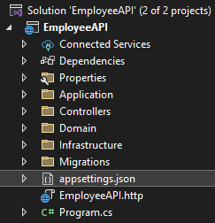

# EmployeeAPI
worked with:
Net: net8.0
Angular CLI: 18.2.0
Node: 20.15.1
Package Manager: npm 10.8.2
OS: win32 x64

Steps to get the app running.
First Step

Create a database under name of EmployeeDB. I used windows authentication, but if you want you can add user and password. 
Update connection string with server name, and if you choose to, user and password, in appsettings.json in EmployeeAPI folder.

    

Second step
To use the Update-Database command with the Package Manager Console (PMC) in EF Core:

First, open the Package Manager Console in Visual Studio.
Ensure the default project in the console is the one containing your EF Core DbContext.
Enter the following command:
Update-Database

Third step
Once database is created, run EmployeesScript.sql. This will create Employee table and Fill it with more than 50000 employees.

Fourth step
Run the API - Open a cmd in EmployeeAPI folder location.
Enter the following command:
dotnet run

Fifth step
Open a cmd in employee-management folder location .
Enter the following command:
ng serve

application will load in the following URL.
http://localhost:4200/
You will see a paginated list of employees and a search bar to look for a specific one.